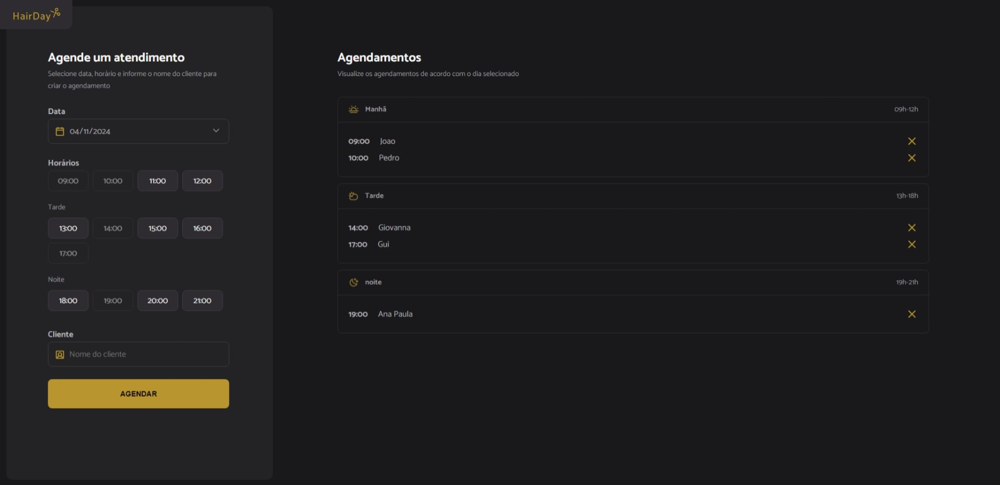

# HairDay - Aplicativo de Agendamento de Cabeleireiro



## Descrição

**HairDay** é uma aplicação web para agendamento de cortes de cabelo, criada com o objetivo de facilitar a organização e gestão dos horários para cabeleireiros e seus clientes. A aplicação permite que os usuários escolham uma data e um horário disponível para seu corte, tornando a experiência de agendamento rápida e conveniente.

## Tecnologias Utilizadas

- **JavaScript**: Lógica do agendamento e manipulação da interface.
- **Webpack**: Ferramenta de empacotamento do projeto.
- **API REST (JSON-Server)**: Banco de dados simulado para armazenamento dos agendamentos.
- **Day.js**: Biblioteca para manipulação de datas.

## Como Executar o Projeto

Siga estas instruções para rodar a aplicação localmente:

### Requisitos

- **Node.js**: Certifique-se de ter o Node.js instalado em sua máquina.
- **NPM**: Gerenciador de pacotes do Node (geralmente vem junto com a instalação do Node.js).

### Passos para Iniciar

1. **Clonar o Repositório**

   ```bash
   git clone https://github.com/ArkaNiightt/Projeto---Hair-Day.git
   cd hairday
   ```

2. **Instalar as Dependências**

   Execute o seguinte comando para instalar as dependências do projeto:

   ```bash
   npm install
   ```

3. **Executar o Servidor Fake (JSON-Server)**

   Para iniciar o servidor que simula a API REST:

   ```bash
   npm run server
   ```

   O servidor JSON estará rodando na porta `3333`.

4. **Iniciar o Servidor de Desenvolvimento**

   Para rodar a aplicação em ambiente de desenvolvimento:

   ```bash
   npm run dev
   ```

   A aplicação estará disponível em `http://localhost:8080`.

## Scripts Disponíveis

- **`npm run build`**: Constrói a aplicação para produção usando o Webpack.
- **`npm run dev`**: Executa a aplicação em ambiente de desenvolvimento.
- **`npm run server`**: Inicia o JSON-Server para simular a API REST.

## Estrutura do Projeto

- **dist/**: Arquivos gerados para produção.
- **node_modules/**: Dependências do projeto.
- **src/**: Contém os arquivos principais da aplicação.
  - **assets/**: Arquivos estáticos, como imagens.
  - **lib/**: Bibliotecas auxiliares.
  - **modules/**: Módulos específicos da aplicação.
  - **services/**: Serviços para comunicação com a API.
  - **styles/**: Arquivos de estilo CSS.
  - **utils/**: Funções utilitárias.
  - **main.js**: Arquivo principal de entrada da aplicação.
- **.gitignore**: Arquivo para definir os arquivos que não devem ser incluídos no controle de versão.
- **index.html**: Página principal da aplicação.
- **package-lock.json**: Arquivo que garante a consistência das versões das dependências instaladas.
- **package.json**: Contém as informações do projeto e suas dependências.
- **server.json**: Arquivo utilizado pelo JSON-Server para armazenar os agendamentos.
- **webpack.config.js**: Arquivo de configuração do Webpack.

## Contribuições

Se você deseja contribuir com este projeto, sinta-se à vontade para abrir um Pull Request. São bem-vindas sugestões de melhorias na interface e no sistema de agendamentos.

## Autor

Criado por **João Augusto**.

## Licença

Este projeto está licenciado sob a [MIT License](LICENSE).

## Contato

- E-mail: [narutogoit@gmail.com](mailto:narutogoit@gmail.com)
- GitHub: [github.com/ArkaNiightt](https://github.com/ArkaNiightt)

---

Obrigado por usar o HairDay! Esperamos que sua experiência seja incrível 🙌.

